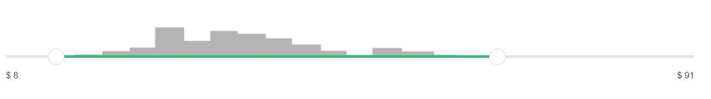

<div align="center">

# Vue Super Slider

</div>

<div align="center">



A super easy to use range slider for any Vue project.

</div>

<div align="center">

  [](https://www.npmjs.com/package/vue-super-slider)
  [](https://snyk.io/test/github/robertcorponoi/vue-super-slider)
  
  [](https://www.npmjs.com/package/vue-super-slider)
  <a href="https://badge.fury.io/js/vue-super-slider"></a>
  <a href="https://badge.fury.io/js/vue-super-slider"></a>
  [](https://gitter.im/robertcorponoi)

</div>

**Table of Contents**

- [Installation](#installation)
- [Initialization](#initialization)
- [Props](#props)
- [Events](#events)
  - [valuesChanged](#valuesChanged)
  - [valuesUpdated](#valuesUpdated)
  - [sliderDragStart](#sliderDragStart)
  - [sliderDrag](#sliderDrag)
  - [sliderDragEnd](#sliderDragEnd)

## **Installation**

To install Vue Super Slider, use:

```bash
$ npm install vue-super-slider
```

## **Initialization**

To use Vue Super Slider in your Vue app, simply import it in the page or component you want to use it in:

```html
<template>
  <div id="app">
    <vue-super-slider :min=0 :max=125></vue-super-slider>
  </div>
</template>

<script>
import Slider from 'vue-super-slider';

export default {
  name: "MyPage",

  components: {
    'vue-super-slider': Slider
  }
};
</script>
```

## **Props**

There are two required props, min and max which signify the minimum and maximum value for the range slider. Any other props are optional and are passed via an options object.

### **min**

The minimum value represented on the slider.

**example**

```html
<vue-super-slider :min=0 :max=125></vue-super-slider>
```

### **max**

The maximum value represented on the slider.

**example**

```html
<vue-super-slider :min=0 :max=125></vue-super-slider>
```

### **options**

There are optional parameters that can be passed as an object to the slider:

- **barColor** - The color of the slider bar that's not between the two handles.
- **barColorActive** - The color of the slider bar that's between the two handles.
- **background** - The background image to use that spans above and across the whole slider.
- **prefix** - A prefix to add to the numbers shown below the slider. For example if you add a '$' then all values will look like they represent a dollar amount to the user.

**example**

```html
<template>
  <div id="app">
    <vue-super-slider :min=0 :max=125 :options="options"></vue-super-slider>
  </div>
</template>

<script>
import Slider from 'vue-super-slider';

export default {
  name: "MyPage",

  components: {
    'vue-super-slider': Slider
  },

  data() {
    return {
      options: {
        barColor: '#444',
        barColorActive: '#337ab7',
        prefix: '$'
      }
    }
  }
};
</script>
```

## **Events**

Now just having the slider wouldn't do you much good if you couldn't do anything based off the values.

### **valuesChanged**

This event is emitted whenever the user clicks, touches, or drags a handle and lets it go. The data emitted with it include the current min and max values of the slider after the event was completed.

**example**

```html
<vue-super-slider :min=0 :max=125 v-on:valuesChanged="valuesChanged"></vue-super-slider>
```

```js
export default {
  methods: {
    valuesChanged(min, max) { }
  }
}
```

### **valuesUpdated**

This event is emitted while any of the handles are actively being dragged. This event will be called frequently and is recommended to be used if you need to work with the values before they're finalized. The data emitted with it include the most up to date min and max values of the slider.

**example**

```html
<vue-super-slider :min=0 :max=125 v-on:valuesUpdated="valuesUpdated"></vue-super-slider>
```

```js
export default {
  methods: {
    valuesUpdated(min, max) { }
  }
}
```

### **sliderDragStart**

This event is emitted whenever one of the handles is clicked on and starting to be dragged. The data emitted with this event is the handle that was dragged (either min or max) and the value of that slider when the event occurred.

**example**

```html
<vue-super-slider :min=0 :max=125 v-on:sliderDragStart="sliderDragStart"></vue-super-slider>
```

```js
export default {
  methods: {
    sliderDragStart(handle, startValue) { }
  }
}
```

### **sliderDrag**

This event is emitted when a handle on the slider is actively being dragged. The data emitted with this event is the handle that is being dragged and its value at that current moment. Note that this event is called frequently so you might want to use a debouce function.

**example**

```html
<vue-super-slider :min=0 :max=125 v-on:sliderDrag="sliderDrag"></vue-super-slider>
```

```js
export default {
  methods: {
    sliderDrag(handle, currentValue) { }
  }
}
```

### **sliderDragEnd**

This event is emitted whenever one of the handles is done being dragged. The data emitted with this event is the handle that is finished being dragged and the value it ended at.

**example**

```html
<vue-super-slider :min=0 :max=125 v-on:sliderDragEnd="sliderDragEnd"></vue-super-slider>
```

```js
export default {
  methods: {
    sliderDragEnd(handle, endValue) { }
  }
}
```

## **License**

MIT